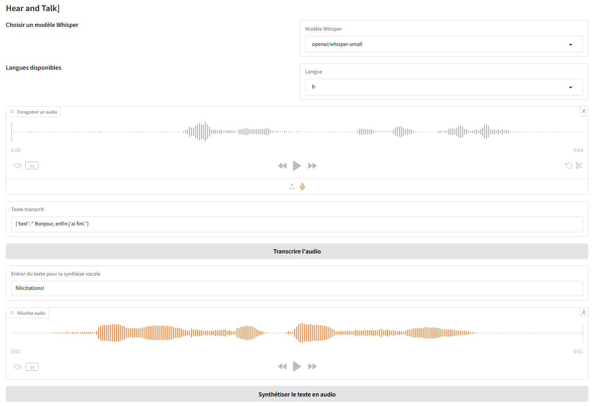

# Hear and Talk

This is a Python application that provides speech-to-text transcription and text-to-speech synthesis functionality using the Whisper model and the gTTS library. The application uses FastAPI to build a RESTful API and Gradio to create a user interface.



## Installation


1. Clone the repository & create pyton env:

```git clone https://github.com/OlivierLAVAUD/hear-and-talk.git```

```git lfs install```

```conda create -n Hear-and-Talk python=3.10```

```conda activate Hear-and-Talk```

2. Install the required Python packages: 

```pip install --upgrade pip```

```pip install --upgrade transformers datasets[audio] accelerate```

```pip install -r requirements.txt```


## Usage

1. Running:

- using FastAPI with a Gradio Interface, simultaneously

``` python app.py```

- using straight code whith a Gradio Interface

``` python main.py```

- using Websockets server and client (Gradio)

``` python websocket_server.py```

``` python websocket_client.py```

- lauching API
 
``` python api.py```

2. Open the Gradio interface in your web browser by visiting `http://localhost:7860`.

3. Use the interface to transcribe audio or synthesize speech.

4. Use the RESTful API to transcribe audio or synthesize speech by sending POST requests to the `/transcribe` or `/synthesize` endpoints(`http://localhost:8000`).

## API Endpoints

- `/transcribe`: Transcribes audio to text. Expects a JSON payload with the following fields:
  - `audio`: The path to the audio file.
  - `language`: The language of the audio.
- `/synthesize`: Synthesizes text to speech. Expects a JSON payload with the following fields:
  - `text`: The text to synthesize.
  - `language`: The language of the text.

## Dependencies

- Python 3.10
- [PyTorch](https://pytorch.org/get-started/locally/)
- [Transformers](https://huggingface.co/transformers/)
- [gTTS](https://pypi.org/project/gTTS/)
- [FastAPI](https://fastapi.tiangolo.com/)
- [Gradio](https://gradio.app/)
- [uvicorn](https://www.uvicorn.org/)
- [librosa](https://librosa.org/doc/main/index.html)
- [requests](https://docs.python-requests.org/en/master/)

## Contributing

Contributions are welcome! If you find a bug or have a feature request, please open an issue or submit a pull request.

## License

This project is licensed under the MIT License. See the `LICENSE` file for details.
